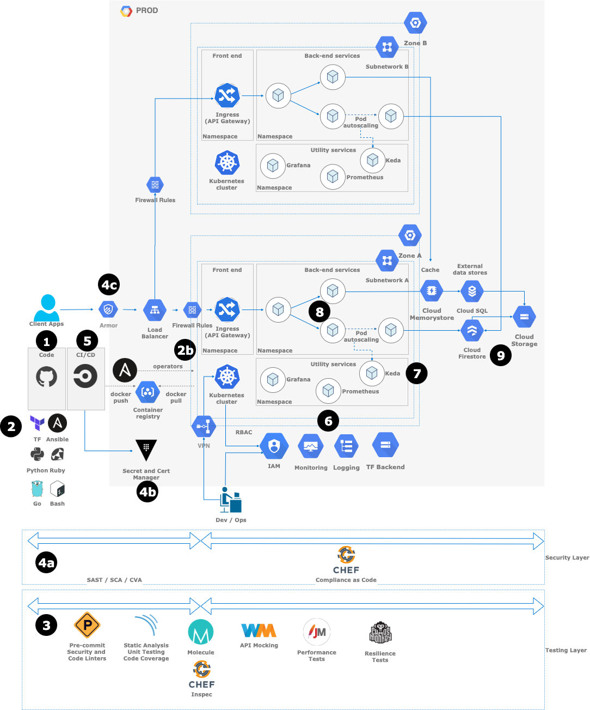
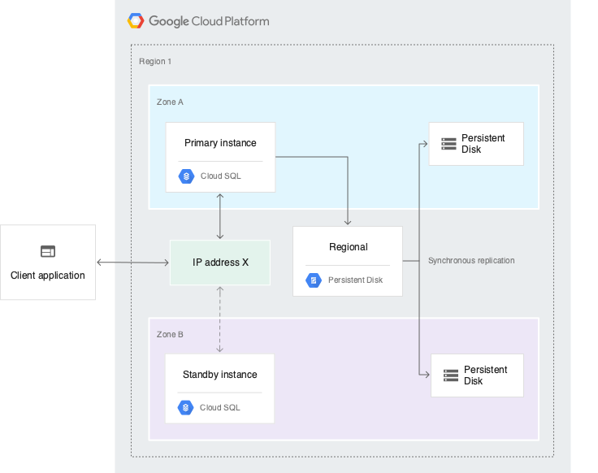

# Microservices - Design Document

## License

The content of this project itself is licensed under the Creative Commons Attribution 3.0 Unported license, and the underlying source code used to format and display that content is licensed under the MIT license.

## Table of Contents

- [Microservices - Design Document](#microservices---design-document)
  - [License](#license)
  - [Table of Contents](#table-of-contents)
  - [1. Introduction](#1-introduction)
    - [1.1 Purpose of the System Design Document (SDD)](#11-purpose-of-the-system-design-document-sdd)
    - [1.2 Audience](#12-audience)
    - [1.3 Background](#13-background)
    - [1.4 Problem statement](#14-problem-statement)
    - [1.5 Strategic Objectives](#15-strategic-objectives)
      - [Table 1: Objectives](#table-1-objectives)
    - [1.6 Project Topics](#16-project-topics)
      - [1.6.1 Required](#161-required)
    - [1.7 Related Projects](#17-related-projects)
    - [1.8 Design Constraints](#18-design-constraints)
      - [Institutional](#institutional)
      - [Technical](#technical)
      - [Financial](#financial)
    - [1.9 Future Contingencies](#19-future-contingencies)
  - [2. Design Guidelines](#2-design-guidelines)
    - [2.1 Stakeholder Roles/Responsibilities/Concerns](#21-stakeholder-rolesresponsibilitiesconcerns)
      - [2.1.1 Technical / Project Stakeholders](#211-technical--project-stakeholders)
        - [Table 2: Project members contact information](#table-2-project-members-contact-information)
      - [2.1.2 Roles](#212-roles)
      - [2.1.3 Responsibilities](#213-responsibilities)
      - [2.1.4 Concerns](#214-concerns)
    - [2.2 Design Considerations](#22-design-considerations)
      - [2.2.1 Assumptions](#221-assumptions)
      - [2.2.2 Constraints](#222-constraints)
      - [2.2.3 Dependencies](#223-dependencies)
      - [2.2.4 Risks](#224-risks)
  - [3. Architecture](#3-architecture)
    - [3.1 High Level Flow Diagrams](#31-high-level-flow-diagrams)
      - [Components View](#components-view)
  - [3.2 Sections](#32-sections)
    - [3.2.1 Section _1_. GitHub and Code Organization](#321-section-1-github-and-code-organization)
    - [3.2.1.1 Important files and directories](#3211-important-files-and-directories)
      - [3.2.1.1.1 `.devcontainer` directory](#32111-devcontainer-directory)
      - [3.2.1.1.2 `.editorconfig`](#32112-editorconfig)
      - [3.2.1.1.3 `.gitattributes`](#32113-gitattributes)
      - [3.2.1.1.4 `.gitignore`](#32114-gitignore)
      - [3.2.1.1.5 `.pre-commit-config.yaml`](#32115-pre-commit-configyaml)
      - [3.2.1.1.6 `.github` directory](#32116-github-directory)
    - [3.2.1.2 Branching Strategy](#3212-branching-strategy)
    - [3.2.1.3 Infrastructure Automation - Terraform and Ansible Git Structure](#3213-infrastructure-automation---terraform-and-ansible-git-structure)
      - [Envs repository](#envs-repository)
      - [Modules Repository](#modules-repository)
      - [Envs and Playbooks repository](#envs-and-playbooks-repository)
    - [Roles repository](#roles-repository)
    - [3.2.1.4 Compliance as Code - Chef Git Structure](#3214-compliance-as-code---chef-git-structure)
    - [3.2.1.5 Python, Go, Ruby and Shell scripting](#3215-python-go-ruby-and-shell-scripting)
    - [3.2.2 Section _2_. Platform automation](#322-section-2-platform-automation)
      - [3.2.2.1 Terraform and Ansible](#3221-terraform-and-ansible)
      - [3.2.2.1.1 A tool for a specific purpose](#32211-a-tool-for-a-specific-purpose)
      - [3.2.2.2 Terraform. How to deploy the solution](#3222-terraform-how-to-deploy-the-solution)
        - [3.2.2.2.1 Sensitive Variables export](#32221-sensitive-variables-export)
        - [3.2.2.2.2 Backend Configuration](#32222-backend-configuration)
        - [3.2.2.2.3 Project Creation](#32223-project-creation)
        - [3.2.2.2.4 GKE Deployment](#32224-gke-deployment)
        - [3.2.2.2.5 Connectivity](#32225-connectivity)
        - [3.2.2.2.6 Zone redundancy](#32226-zone-redundancy)
      - [3.2.2.3 Terraform. Versioned modules](#3223-terraform-versioned-modules)
      - [3.2.2.4 Other Services](#3224-other-services)
      - [3.2.2.5 Section _2b_Ansible. Kubernetes Operators. Microservices Deployment](#3225-section-_2b_ansible-kubernetes-operators-microservices-deployment)
    - [3.2.3 Section _3_. Testing](#323-section-3-testing)
    - [3.2.3.1 Pre-Commit](#3231-pre-commit)
    - [3.2.3.2 Code Testing and Integration Tests on CI](#3232-code-testing-and-integration-tests-on-ci)
    - [3.2.3.3 Performance Testing](#3233-performance-testing)
    - [3.2.3.3.1 Operator SDK Testing](#32331-operator-sdk-testing)
    - [3.2.3.3.2 JMeter Testing and API Mocking](#32332-jmeter-testing-and-api-mocking)
    - [3.2.3.4 Resilience Testing](#3234-resilience-testing)
    - [3.2.4 Section _4a_. Code and CI/CD Security](#324-section-4a-code-and-cicd-security)
      - [3.2.4.1 Code Security - SAST, SCA and CVA](#3241-code-security---sast-sca-and-cva)
      - [3.2.4.2 Compliance as Code](#3242-compliance-as-code)
    - [3.2.5 Section _4b_. Passwords and Certificates Security](#325-section-4b-passwords-and-certificates-security)
    - [3.2.6 Section _4c_. WAF and Security Audit - Armor](#326-section-4c-waf-and-security-audit---armor)
    - [3.2.7 Section _5_. Continuous Integration and Deployment](#327-section-5-continuous-integration-and-deployment)
    - [3.2.8 Section _6_. Logging, Metrics and Traceability](#328-section-6-logging-metrics-and-traceability)
    - [3.2.8.1 Google Cloud Operations (Stackdriver)](#3281-google-cloud-operations-stackdriver)
      - [3.2.8.1.1 Log Definition and Best Practices](#32811-log-definition-and-best-practices)
      - [3.2.8.2 K8S Health Checks and Metrics](#3282-k8s-health-checks-and-metrics)
    - [3.2.9 Section _7_. Event-Driven autoscaling - KEDA](#329-section-7-event-driven-autoscaling---keda)
      - [3.2.9.1 Kubernetes Cluster Autoscaling](#3291-kubernetes-cluster-autoscaling)
    - [3.2.10 Section _8_. Microservices Fault Tolerance - Istio](#3210-section-8-microservices-fault-tolerance---istio)
    - [3.2.11 Section _9_. Database and Storage High availability](#3211-section-9-database-and-storage-high-availability)
      - [3.2.11.1 Backups](#32111-backups)
      - [3.2.11.2 Multicloud](#32112-multicloud)
  - [4. Conclusion](#4-conclusion)
  - [5. Project Strategy](#5-project-strategy)
    - [5.1 Key Milestones and Deliverables](#51-key-milestones-and-deliverables)

## 1. Introduction

**Project Name:** Microservice Architecture

**Project Sponsor/Executive:** Jose Angel Munoz

### 1.1 Purpose of the System Design Document (SDD)

The SDD documents and tracks the necessary information required to effectively define architecture and system design in order to give the development team guidance on the architecture of the system to be developed. Design documents are incrementally and iteratively produced during the system development life cycle, based on the particular circumstances of the information technology (IT) project and the system development methodology used for developing the system.

### 1.2 Audience

The intended audience for the SDD is the project manager, project team, and the future development team. The audience or users for this system design document include the following:

- Project Sponsor
- Platform Lead
- Platform Development and Operations Team

### 1.3 Background

The key principle of microservices is simplicity. Microservices is an approach to developing a single application as a suite of small services, each running in its own process and communicating with lightweight mechanisms, often an HTTP resource API. These services are built around business capabilities and independently deployable by fully automated deployment machinery. There is a bare minimum of centralized management of these services, which may be written in different programming languages and use different data storage technologies.

### 1.4 Problem statement

Monolithic architectures means the code’s components are designed to work together, as one cohesive unit, sharing the same memory space. The software built using a monolith approach is self-contained; its components are interconnected and interdependent. If developers want to make any changes or updates to a monolith system, they need to build and deploy the entire stack at once. It’s the same thing with scalability: the entire system, not just the modules in it, is scaled together. With the monolithic architecture it can be difficult to adopt a new technology stack, and in case you want to use a new platform or framework, you’ll have to rewrite the entire solution.

### 1.5 Strategic Objectives

The most important objective is to define an architecture based on processes and not tools. When selecting specific tools, we need to keep in mind the possibility to migrate/change if the maintenance or learning curve is too high. It is important to stick in the KISS and Everything as Code minds. The microservices arquitecture objectives are:

- Allow a system to be divided into a number of smaller, individual and independent services.
- Each service is flexible, robust, composable and complete.
- They run as autonomous processes and communicate with one another through APIs.
- Each microservice can be implemented in a different programming language on a different platform.
- Almost any infrastructure can run in a container which holds services encapsulated for operation.
- Since these containers can be operated in parallel, the existing infrastructure is easier to maintain.

#### Table 1: Objectives

You have to implement a microservices architecture with the following requirements:

| Strategic Objectives                 | Measure                                                  |
|--------------------------------------|----------------------------------------------------------|
| Quality Gates Creation               | Define Pre-Commit Linters                                |
| Continuous Integration Quality Gates | Define Quality Gates on CI                               |
| Continuous Integration Security      | Define Security on CI                                    |
| Integration Tests                    | Define Integration Tests                                 |
| Deploy and Configure Infrastructure  | Implement IAC on CI/CD                                   |
| Autoscaling                          | Implement Event Managed for POD and Cluster Autoscaling  |
| Container Security                   | Define and Implement Container Security                  |
| Infrastructure Security              | Define Compliance as Code                                |
| Monitoring                           | Define the best monitoring approach for Infra and Apps   |
| Certificates and Passwords           | Define how to implement password and cert security       |
| Data Store                           | Add Relational and not relational Data Store             |
| Logging                              | Define central logging and rules                         |
| Fault Tolerance                      | Add Istio for Fault Tolerance                            |
| Multi-zone                           | Define Multi-zone for Distributed Content and Redundancy |
| Environments                         | Define how to work with different environments           |
| Upgrade Process                      | How to upgrade - Operators                               |

### 1.6 Project Topics

1. Git as code repository
2. Code Quality Security
3. Continuous Integration and Deployment
4. Integration Tests
5. Compliance as Code (Post Deployment)
6. Infrastructure Automation
7. Keda for Autoscaling
8. Container Security
9. Monitoring and Performance
10. Password Security and HTTPS certificates with Vault
11. Relational SQL and NoSQL for data store
12. Logging
13. Istio for Fault Tolerance
14. Cloud Multi-zone redundancy
15. Environment Definition
16. Upgrade Processes

#### 1.6.1 Required

1. Select a Infrastructure Cloud platform
2. Select orchestration technology
3. Define the solution to automate the infrastructure deployment
4. Define the solution to automate the microservices deployment
5. Define the testing approach for the infrastructure
6. Define the monitoring approach for the solution

### 1.7 Related Projects

There are no related projects attached to this document. This is an independent project.

### 1.8 Design Constraints

#### Institutional

The proposed solution will be discussed and improved by all the Teams. Coordination and collaboration is always required.

#### Technical

The proposed solution intends to standardize all the lines in the Platform and will be the base to prepare the right tools to improve it in the future. There are different subjects that needs to be managed properly during the lifetime of the Project and are a **MUST** to maintain the Quality and Structure of the Platform:

- Review if Windows support is needed.
- Best Practices Documentation.
- Clear Understanding about The Team Way of Working.
- Design Documentation Approvals before starting the implementation.

#### Financial

There will be different proposals to adjust the solution PAAS vs IAAS custom solutions. It is important to review how the different technologies can be scaled out or switched off to save costs.

### 1.9 Future Contingencies

We have different dependencies for this project and some are critical to the security the Framework, defined under the [Conclusion Section](#4-conclusion).

- Oauth and RBAC Definition and implementation
- POD and Container Security Definition
- API Gateway Definition
- Networking Definition
- Cache Management
- Self-Service for Infrastructure
- Cost Management

## 2. Design Guidelines

### 2.1 Stakeholder Roles/Responsibilities/Concerns

System design can cross many different groups within an organization to ensure requirements are gathered and met for all stakeholders. As such, the roles and responsibilities section may be necessary to provide the team with clarification on who performs various roles. This section also serves as a list of points of contact for the team and stakeholders should issues and concerns arise which need to be addressed.

#### 2.1.1 Technical / Project Stakeholders

The following table provides the role and contact information for the key technical and project stakeholders associated with the system design.

##### Table 2: Project members contact information

| Name             | Role              | email                 |
|------------------|-------------------|-----------------------|
| Jose Angel Munoz | Executive Sponsor | josea.munoz@gmail.com |

#### 2.1.2 Roles

- **Executive Sponsor**:
    1. *Approver and Sponsor* of the Solution as they will follow and approve the Solution Implementation.

- **IAC Lead**:
    1. *Managers* of the Solution as they will conduct next steps and act as referees

- **IAC Developers**:
    1. *Reviewers* of the Solution as they review code of the platform itself and ensure the quality of the solution.

#### 2.1.3 Responsibilities

- **IAC Lead**:
    1. Review Document

- **IAC Developer**:
    1. Review Document

#### 2.1.4 Concerns

The solution will cover the most important topics and will be focused on **GCP** as the default Cloud provider.

### 2.2 Design Considerations

#### 2.2.1 Assumptions

1. Use Git for code repository with **GitHub** as provider.
2. Use of **Terraform** for infrastructure deployment as the default and **Ansible** for orchestration, configuration and K8s Operators.
3. Use of **Bash**, **Python**, **Ruby** and **Go** as coding languages.
4. Use of VSCode as default IDE.

#### 2.2.2 Constraints

No constraints have been detected so far.

#### 2.2.3 Dependencies

The current implementation is dependent on the following technologies and providers among others:

- Google Cloud Platform
- GitHub
- Pre-Commit
- Kubernetes (GKS)
- Terraform
- Vault
- Ansible and Molecule
- Chef
- JMeter
- Keda
- Istio
- Prometheus
- ELK
- Grafana

#### 2.2.4 Risks

Minimal risk is associated with the system design. This is primarily due to the fact that the current and architecture will not be modified to meet the needs of the proposed solution. New features and solutions can be implemented without breaking current implementations.

Properly Alignment with the the teams (Two-Way KT and Support) and splitting the project in phases are key for its implementation.

## 3. Architecture

### 3.1 High Level Flow Diagrams

#### Components View



## 3.2 Sections

### 3.2.1 Section _1_. GitHub and Code Organization

In the Section 1, we will define a standard repository for most programming languages. The idea is implementing good practices and cover most of the scenarios.

### 3.2.1.1 Important files and directories

#### 3.2.1.1.1 `.devcontainer` directory

`.devcontainer` will contain a default configuration to use with VSCode Remote-Containers Plugin. This is a way to have a controlled scenario for local testing. It has the following structure:

```bash
.devcontainer/
├── Dockerfile
├── README.md
└── devcontainer.json
scripts/
└── common-debian.sh
```

The `devcontainer.json` has the configuration for VSCode. For instance the extensions and default settings:

```json
// Set *default* container specific settings.json values on container create.
"settings": {
    "terminal.integrated.shell.linux": "/bin/bash",
    "python.pythonPath": "/usr/local/bin/python",
    "python.linting.enabled": true,
    "python.linting.pylintEnabled": true,
    "python.linting.banditPath": "/usr/local/py-utils/bin/bandit",
    "python.linting.pylintPath": "/usr/local/py-utils/bin/pylint",
    "python.testing.pytestPath": "/usr/local/py-utils/bin/pytest"
},
// Add the IDs of extensions you want installed when the container is created.
"extensions": [
    "ms-python.python",
    "vscoss.vscode-ansible",
    "redhat.vscode-yaml",
    "ms-vscode.azurecli",
    "ms-azuretools.vscode-docker"
],
```

The `Dockerfile` will be used to build the container with all the specific tools for the development. It uses the `common-debian.sh` script to build it. More information. More info at [VS Code Remote Development GitHub](https://github.com/microsoft/vscode-dev-containers).

#### 3.2.1.1.2 `.editorconfig`

The [editorconfig](http://EditorConfig.org) helps developers define and maintain consistent coding styles between different editors and IDEs

```ini
# top-most EditorConfig file
root = true

# Unix-style newlines with a newline ending every file
[ ]
charset = utf-8
end_of_line = lf
insert_final_newline = true
trim_trailing_whitespace = true

[*.{py,rst,ini}]
indent_style = space
indent_size = 4

[*.{yml,yaml}]
indent_style = space
indent_size = 2
```

#### 3.2.1.1.3 `.gitattributes`

Automatically normalize line endings for all text-based files

```ini
* text=auto eol=lf
* whitespace=space-before-tab,tab-in-indent,trailing-space,tab
*.{cmd,[cC][mM][dD]} text eol=crlf
*.{bat,[bB][aA][tT]} text eol=crlf
*.{py} text eol=lf diff=python


.gitattributes export-ignore
.gitignore export-ignore
.gitmodules export-ignore
```

#### 3.2.1.1.4 `.gitignore`

A `.gitignore` file specifies intentionally untracked files that Git should ignore.

```ini
### Sandbox: anything in that directory will be ignored
sandbox/
secrets/
.vscode/

.vagrant
*/packer_cache/*
*/packer_iso/*

.pe_build
*.dpkg-dist
*.rpmnew
```

#### 3.2.1.1.5 `.pre-commit-config.yaml`

The [pre-commit](https://pre-commit.com/) config file describes what repositories and hooks are installed for pre-commit. This file is located in the root of every project and as noticed is a YAML file with the different tasks to run.

We will use this tool for static code analysis and other utilities that will run before committing code to the repo. All these functionalities added to pre-commit will be reused in the CI process.

#### 3.2.1.1.6 `.github` directory

It contains all the GitHub templates and document to standardize the project. Adding this structure as a project in the GitHub Organization will affect all the projects.

```bash
.github/
├── CODE_OF_CONDUCT.md
├── CONTRIBUTING.md
├── ISSUE_TEMPLATE
│   ├── bug_report.md
│   ├── config.yml
│   ├── documentation_report.md
│   └── feature_request.md
├── ISSUE_TEMPLATE.md
└── PULL_REQUEST_TEMPLATE.md
```

An example of every file can be found at [GitHub](https://github.com/imjoseangel/open-source-contribution/tree/devel/.github).

### 3.2.1.2 Branching Strategy

To improve team collaboration, quality and fast deployments, the best Branching strategy is *Trunk Based Development* or *GitHub Flow* (Don't confuse with *Git Flow*) alternative that adds different mechanism to the release process but keeps the soul of the *Trunk Based*.

Besides all the advantages from the *Trunk Based*, the *GitHub Flow* will help developers to understand and collaborate more actively with Open Source and learn techniques to apply to the platform.

### 3.2.1.3 Infrastructure Automation - Terraform and Ansible Git Structure

When creating infrastructure as code, there are different aspects to take into account:

- Code Maintainability and Reusable
- Deployment Speed and Reliability
- Idempotency
- Testing
- Self-Service

We have chose Ansible for Configuration Management and Terraform for Provisioning. It is important to make the most of both tools to achieve the points defined above.

The recommendation is keeping the following structure for **Terraform**, using reusable modules and specific environments:

#### Envs repository

```bash
.
└── envs
    ├── prod
    │   └── services
    │       └── gke-cluster
    │           ├── main.tf
    │           ├── outputs.tf
    │           └── vars.tf
    └── dev
        └── services
            └── gke-cluster
                ├── main.tf
                ├── outputs.tf
                └── vars.tf
```

#### Modules Repository

```bash
.
└── modules
    └── services
        └── gke-cluster
            ├── main.tf
            ├── outputs.tf
            └── vars.tf
```

Where the environment reads the module and the release (Tagged as v20200825):

```yaml
module "gke" {
  source     = "github.com/imjoseangel/modules/services/gke-cluster?ref=v20200825"
  project_id = var.project_id
  name       = "${local.cluster_type}-cluster${var.cluster_name_suffix}"
  region     = var.region
  network    = var.network
  subnetwork = var.subnetwork

  ip_range_pods          = var.ip_range_pods
  ip_range_services      = var.ip_range_services
  create_service_account = false
  service_account        = var.compute_engine_service_account
}
```

For **Ansible** the recommendation is mostly the same:

Keep reusable roles with specific environments:

#### Envs and Playbooks repository

```bash
.
├── inventories
│   └── local
│       └── hosts
├── playbooks
│   └── gke
│       ├── main.yml
│       └── pretasks.yml
├── roles
│   ├── gke-cluster
│   │   ├── README.md
│   │   ├── defaults
│   │   │   └── main.yml
│   │   ├── files
│   │   │   └── hostsfile
│   │   ├── handlers
│   │   │   └── main.yml
│   │   ├── meta
│   │   │   └── main.yml
│   │   ├── tasks
│   │   │   ├── create.yml
│   │   │   ├── delete.yml
│   │   │   └── main.yml
│   │   └── vars
│   │       └── main.yml
│   └── requirements.yml
└── vars
    ├── prod
    │   └── common.ym
    └── dev
        └── common.yml
```

### Roles repository

A repository is needed with the following structure:

```bash
.
├── meta
│   └── main.yml
├── role1
├── role2
└── role*N*
```

### 3.2.1.4 Compliance as Code - Chef Git Structure

Simple, the recommendation is to keep the structure given by [dev-sec](https://github.com/dev-sec). For internal developments, we should keep the same.

We can keep different environments, but initially better to have a common one.

```bash
.
├── Gemfile
├── Rakefile
├── controls
│   ├── control1_spec.rb
│   ├── control2_spec.rb
│   └── control*N*_spec.rb
├── inspec.yml
└── libraries
    ├── library1.rb
    ├── library2.rb
    └── library*N*.rb
```

### 3.2.1.5 Python, Go, Ruby and Shell scripting

The recommendation is to keep as much consistency as possible and keep every tool with their code base to have clear testing processes and avoid long testing processes. Also it is important to have a collaboration mind and maintain the community with fixes directly to the main projects (Terraform, Ansible, Dev-Sec, etc).

- Terraform -> Go
- Ansible -> Python
- Chef and Inspec -> Ruby

Using Python as default will give us the possibility to use tools like pre-commit. Also python is by default in all the *nix Systems, so it it easier to run. Programming small scripts in bash when needed is perfect (Docker entrypoints, pre-commit hooks, etc), but we need to be sure that is compatible with other shells like `zsh` or `ksh`.

If needed remember that Powershell is also an option and mostly when talking about Windows environments.

### 3.2.2 Section _2_. Platform automation

#### 3.2.2.1 Terraform and Ansible

When talking about cloud, there is a difference between Terraform and Ansible at the time of deploy a service. *Terraforn* has a declarative style that specified the desired end state. Ansible can usually do both procedural and declarative, but the learning curve to implement this last option is medium to high.

When working with Terraform, we need to be careful to not remove already created component when changing a bit of code.

For instance if we want to install a GKE we can do:

```yaml
resource "google_container_cluster" "primary" {

  name     = "my-gke-cluster"
  location = "us-central1"
...
}
```

That will install a single GKE.

But if we change to:

```yaml
resource "google_container_cluster" "primary" {
  count    = length(var.k8s_names)
  name     = "${var.k8s_names[count.index]}-gke"
  location = "us-central1"
...
}
```

Where vars is

```yaml
variable "k8s_names" {
  description = "Create AKS with these names"
  type        = list(string)
  default     = ["phineas", "ferb", "candace"]
}
```

It will destroy `my-gke-cluster` and create 3 new clusters with the given name.

This scenario is perfect for inmmutable infrastructure and is something not inherent in the Ansible philosophy. That is the flaw point for Ansible, you need to create bunch of code for a simple operation like this.

In the other hand, the flaw point of Terraform is knowing what is already in place. And even removing what was created manually or even in previous processes. Here is where Ansible can help if needed.

#### 3.2.2.1.1 A tool for a specific purpose

The important point here is using only one tool for a specific purpose if possible. When finding an issue working with multiple tools is harder to debug it due to the complexity of the solution. The simple, the better.

We choose:

- Terraform for infrastructure deployment. Learning Curve is low, we can create a good code structure, it can create and destroy in parallel and has a good Cloud support.
- Ansible for testing, operator creation and deployment and cleaning. The learning curve for a good architecture is higher but for testing, operators, cleaning processes and even to create status for Terraform is perfect.

#### 3.2.2.2 Terraform. How to deploy the solution

The most important part is following the structure defined under [git rules](#envs-repository). Under GCP, we will create one project per environment. If we need to create different isolated applications, we will create a project per application per environment. In this document we assume we have only one application, so we will create two projects.

> Note: All the operations explained below has to be done on CI and with the right security from the beginning. The solution for password management is **Hashicorp Vault**

We assume that the initial service account is already configured to do the deploy with the right permissions and API enabled:

```bash
cloudresourcemanager.googleapis.com
cloudbilling.googleapis.com
iam.googleapis.com
compute.googleapis.com
serviceusage.googleapis.com
```

##### 3.2.2.2.1 Sensitive Variables export

Export of sensitive information as environment variables is the better choice. As said, this will be done with variables on the CI process.

```bash
TF_VAR_org_id
TF_VAR_billing_account
TF_ADMIN
TF_CREDS
GOOGLE_APPLICATION_CREDENTIALS=${TF_CREDS}
GOOGLE_PROJECT=${TF_ADMIN}
```

##### 3.2.2.2.2 Backend Configuration

We assume that a backend for the `.tfstate` is already created and with Object Versioning enabled: `gsutil versioning set on gs://${TF_ADMIN}`. This will allow state recovery in case of deletion.

The `backend.tf` file will be like:

```yaml
terraform {
 backend "gcs" {
   bucket  = "${TF_ADMIN}"
   prefix  = "terraform/state"
 }
}
```

Do terraform init --backend-config="encryption_key=SECRET" to encrypt the backend.
The encryption key WILL be written to the .terraform directory. This needs to be managed and store in the *Vault* solution.

##### 3.2.2.2.3 Project Creation

> Note: From now on, we assume that all the calls are referring as modules with this format:

```yaml
module "project" {
  source          = "github.com/imjoseangel/modules/services/gcp-project?ref=v20200825"
  project_id      = var.project_id
  name            = var.project_name
}
```

Where the `vars.tf` file is:

```yaml
variable "project_id" {
  description = "The id of the project"
  type        = string
}

variable "project_name" {
  description = "The name of the project"
  type        = string
}
```

And the module will contain:

```yaml
resource "google_project" "project" {
  count           = length(var.env_names)
  project_id      = "${var.project_id}-${var.env_names[count.index]}
  name            = "${var.project_name}-${var.env_names[count.index]}
  billing_account = var.billing_account
  org_id          = var.org_id
}
```

The module variables:

```yaml
variable "env_names" {
  description = "Create environments"
  type        = list(string)
  default     = ["prod", "dev"]
}
```

Although this is a very simple example, find that the main module is totally inmutable and will define the environments by default.

##### 3.2.2.2.4 GKE Deployment

We will take a GKE as deployment example with NGIX Ingress. The rest of the components will follow the same structure. There are different topics that will be covered later as networking or security.

Besides the GKE Creation:

```yaml
resource "google_container_cluster" "primary" {
  name     = "my-gke-cluster"
  location = "us-central1"

  remove_default_node_pool = true
  initial_node_count       = 1
...
}

resource "google_container_node_pool" "primary_preemptible_nodes" {
  name       = "my-node-pool"
  location   = "us-central1"
  cluster    = google_container_cluster.primary.name
  node_count = 1

  node_config {
    preemptible  = true
    machine_type = "e2-medium"

    metadata = {
      disable-legacy-endpoints = "true"
    }

    oauth_scopes = [
      "https://www.googleapis.com/auth/logging.write",
      "https://www.googleapis.com/auth/monitoring",
    ]

    tags = ["mygkenodes"]
  }
}
```

For production, the automation needs to be more advanced, for instance the tags creation defining locals:

```yaml
locals {
  # Common tags to be assigned to all resources
  common_tags = {
    Service = local.service_name
    Owner   = local.owner
  }
}
```

And apply them like:

```yaml
tags = local.common_tags
```

Or a more advanced approach:

```yaml
locals {
  node_pools_tags = merge(
    { all = [] },
    { default-node-pool = [] },
    zipmap(
      [for node_pool in var.node_pools : node_pool["name"]],
      [for node_pool in var.node_pools : [ ]
    ),
    var.node_pools_tags
  )
}
```

```yaml
tags = concat(
    lookup(local.node_pools_tags, "default_values", [true, true])[ ] ? [local.cluster_network_tag] : [],
    lookup(local.node_pools_tags, "default_values", [true, true])[ ] ? ["${local.cluster_network_tag}-${each.value["name"]}"] : [],
    local.node_pools_tags["all"],
    local.node_pools_tags[each.value["name"]],
)
```

It is possible to deploy the Ingress with Terraform too:

```yaml
resource "kubernetes_pod" "nginx" {
  metadata {
    name = "nginx"

    labels = {
      maintained_by = "terraform"
      app           = "nginx"
    }
  }

  spec {
    container {
      image = "nginx:1.7.9"
      name  = "nginx"
    }
  }

  depends_on = [module.gke]
}
```

And the LoadBalancer

```yaml
resource "kubernetes_service" "nginx" {
  metadata {
    name = "terraform"
  }

  spec {
    selector = {
      app = kubernetes_pod.nginx.metadata[ ].labels.app
    }

    session_affinity = "ClientIP"

    port {
      port        = 8080
      target_port = 80
    }

    type = "LoadBalancer"
  }

  depends_on = [module.gke]
}
```

Have a look to the `depends_on` option that will wait and confirm that gke is created already.

One of the most important pieces in this architecture is the Load Balancer. It will maintain the SSL certificates stored in the Vault.

```yaml
resource "google_compute_ssl_certificate" "default" {
  project     = "${var.project}"
  name_prefix = "${var.name}-certificate-"
  private_key = "${var.private_key}"
  certificate = "${var.certificate}"

  lifecycle = {
    create_before_destroy = true
  }
}
```

And firewall rules among other configuration options:

```yaml
resource "google_compute_firewall" "default-hc" {
  project       = "${var.firewall_projects}"
  name          = "${var.name}"
  network       = "${var.firewall_networks}"
  source_ranges = ["46.6.3.128/28"]
  target_tags   = ["${var.target_tags}"]

  allow {
    protocol = "tcp"
    ports    = ["${var.backend_params}"]
  }
```

One interesting concept is the `targed_tags` configured in the node_pools and referenced as example.

Fully recommended to read the code for the Terraform Google Modules on [Github](https://github.com/terraform-google-modules/terraform-google-kubernetes-engine)

##### 3.2.2.2.5 Connectivity

We are not going to cover all the networking facts in this document as it could be a huge topic. In the other hand, VPN connectivity is important as most of the services needs to be protected through IAMS, 2FA and certificates when possible.

```yaml
resource "google_compute_vpn_tunnel" "tunnel1" {
  name          = "tunnel1"
  peer_ip       = "15.0.0.120"
  shared_secret = "a secret message"

  target_vpn_gateway = google_compute_vpn_gateway.target_gateway.id
}

resource "google_compute_vpn_gateway" "target_gateway" {
  name    = "vpn1"
  network = "mynetwork"
}
```

##### 3.2.2.2.6 Zone redundancy

The Load balancer configuration will cover both Clusters in Zone A and Zone B for a distributed configuration and Zone redundancy.

#### 3.2.2.3 Terraform. Versioned modules

Following the structure defined in the [Important](#3211-important-files-and-directories), it is important to define a release strategy for the modules. If you’re using GitHub, you can use the GitHub UI to create a release, which will create a tag under the hood.

Now you can use this versioned module in both staging and production by specifying a Git URL in the source parameter.

When using the module just specify the tag:

```yaml
module "webserver_cluster" {
  source = "github.com/imjoseangel/myterraform/modules/mycluster?ref=v0.0.1"
```

#### 3.2.2.4 Other Services

As discussed before, the implementation of other PaaS will be performed in the same way. It is important to analyze the cost vs maintenance vs functionality for the given services. For instance, using PostgreSQL can be quite cheaper than using the firestore option. Creating IAAS services need VM Operating System maintenance and the backup options are not as straight-forwards than the one inside the PaaS, but it is important to take this option into account for small services and POCs.

Deployment a IaaS with terraform is quite straightforward (Besides Networking, firewalling, etc):

```yaml
resource "google_compute_instance" "default" {
  name         = "myvm"
  machine_type = "n1-standard-1"
  zone         = "us-central1-a"

  tags = ["foo", "bar"]

  boot_disk {
    initialize_params {
      image = "debian-cloud/debian-10"
    }
  }

  // Local SSD disk
  scratch_disk {
    interface = "SCSI"
  }

  network_interface {
    network = "default"

    access_config {
    }
  }

  service_account {
    scopes = ["userinfo-email", "compute-ro", "storage-ro"]
  }
}
```

The important part is to configure and harden it properly. Here is were the Compliance as Code and Ansible mark the difference. Chef for testing, Ansible to implement it. We will discuss this later in the security section. [GitHub Link](https://github.com/dev-sec)

#### 3.2.2.5 Section _2b_Ansible. Kubernetes Operators. Microservices Deployment

Ansible is perfect to create operators to be deployed. A K8S Operator can complete complex tasks in order to achieve the desired changes in the application’s output. It is clear that Operators is the present and the future to manage Kubernetes clusters.

It can automatically handle such tasks as:

- Deploying applications
- Updating applications to new versions
- Reconfiguring application settings
- Scaling applications up and down depending on usage
- Failure handling
- Setting up monitoring infrastructure

The Kubernetes Operator is able to modify the configuration and usage of an application based on the application’s output. This is determined by the custom resources defined for that application. Custom resources showing the desired state and custom resources showing the current state form a loop. The Operator observes the current state and then takes actions that will make the application produce the desired state. After the actions are executed, the current state is reevaluated and the loop begins again.

For example, a custom resource could define the desirable state of a new server instance as some amount of load capability based on its physical resources.The Operator would then adjust the configuration until new instances reached these standards.

Creating an Ansible Operator:

As simple as:

```bash
operator-sdk init --plugins=ansible --domain example.com
```

We will create the API:

```bash
operator-sdk create api --group myapp --version v1alpha1 --kind MyApp --generate-role
```

One of the most important files here is the `watches.yml` file. Reference [here](https://sdk.operatorframework.io/docs/building-operators/ansible/reference/watches/)

For the logic, we will just configure the Ansible Role:

```yaml
- name: start myapp
  community.kubernetes.k8s:
    definition:
      kind: Deployment
      apiVersion: apps/v1
      metadata:
        name: '{{ ansible_operator_meta.name }}-myapp'
        namespace: '{{ ansible_operator_meta.namespace }}'
      spec:
        replicas: "{{size}}"
        selector:
          matchLabels:
            app: myapp
        template:
          metadata:
            labels:
              app: myapp
          spec:
            containers:
            - name: myapp
              command:
              - myapp
              image: "docker.io/myapp:1"
              ports:
                - containerPort: 8080
```

This is the main configuration. To finish and push the container to the registry:

```bash
make docker-build docker-push IMG=docker.io/myapp:1
```

And to deploy it:

```bash
export IMG=docker.io/myapp:1
make deploy
```

```bash
kubectl apply -f config/samples/cache_v1alpha1_myapp.yaml
```

### 3.2.3 Section _3_. Testing

Before continuing with other sections, it is fundamental to define how to test or developments and integrations. There will be different test phases, some running on our local computers, some on CI and some when going to production. We are going to try to conver some and going through the most important phases.

### 3.2.3.1 Pre-Commit

It hooks *git* scripts for identifying simple issues in the code that's about to be committed. We will use pre-commit for linting and security.

##### The `.pre-commit-config.yaml` file

This file is located in the root of every project with the different tasks to run:

```yaml
---
repos:
  - repo: local
    hooks:
      - id: ansible-lint
        name: Ansible-lint
        description: This hook runs ansible-lint.
        entry: ansible-lint
        language: system
        files: \.(yaml|yml)$

      - id: yamllint
        name: yamllint
        args: ['--strict']
        entry: yamllint
        language: system
        types: [file, yaml]

      - id: terraform_fmt
        name: terraform_fmt
        description: Formats terraform scripts into the correct checkstyle
        entry: bin/tf_fmt.sh
        language: script
        files: \.tf$
        exclude: \.terraform\/.*$

      - id: terraform_validate
        name: terraform_validate
        description: Validates terraform scripts syntax
        entry: bin/tf_validate.sh
        language: script
        files: \.tf$
        exclude: \.terraform\/.*$

      - id: detect-secrets
        name: Detect Secrets
        description: This hook detects and prevents high entropy strings from entering the codebase.
        entry: detect-secrets-hook
        language: system

  - repo: git://github.com/pre-commit/pre-commit-hooks
    rev: v2.5.0
    hooks:
        - id: check-yaml
        - id: end-of-file-fixer
        - id: trailing-whitespace
        - id: check-case-conflict
        - id: check-merge-conflict
        - id: check-executables-have-shebangs
```

The idea of the pre-commit is running basic code tests on every commit and ensure that the code does not contain basic security issues (Passwords or tokens). *Linting* is the process of checking the source code for *Programmatic* as well as *Stylistic* errors. This is most helpful in identifying some common and uncommon mistakes that are made during coding. - [StackOverflow](https://stackoverflow.com/questions/8503559/what-is-linting).

Depending on the programming language, different linters need to be defined. For instance `rubocop` for Ruby or `shellcheck` for shell scripting. There are other generic as `trailing-whitespace` that trims trailing whitespace or `end-of-file-fixer` that ensures that a file is either empty, or ends with one newline.

Check [pre-commit hooks page](https://pre-commit.com/hooks.html) and [GitHub](https://github.com/pre-commit/pre-commit-hooks) for more info.

### 3.2.3.2 Code Testing and Integration Tests on CI

The most typical tool for Static Analysis and Unit Testing is Sonar, but on CI and mostly for Infrastructure, unit testing are not easy to find. If we don't require cool reporting boards, but we want to keep quality, the same `pre-commit` hooks can be reutilized in Continous Integration (Sanity Testing) together with the Integration Tests.

There are two nice tools to test our deployments: `molecule` and `inspec`. Both are really powerful and good options with low learning curve. We will use both for operators and security respectively so is a question of deciding as a team what is the best option for integration testing. Both tools can work together and molecule support inspec as assertion tool.

As said, `molecule` tests can integrate also infrastructure and operators testing like:

```yaml
- name: Assert provisioning, acls and secrets
  assert:
    that:
      - vaultspolicies is iterable
      - vaultspolicies | length() == 1
      - "'{{ vaults[ ].name }}' == 'myvault'"
      - "'{{ vaults[ ].vault_uri }}' == 'https://myvault'"
      - vaultspolicies[ ].object_id is match('[A-Za-z0-9]{8}\-[A-Za-z0-9]{4}\-[A-Za-z0-9]{4}\-[A-Za-z0-9]{4}\-[A-Za-z0-9]{12}')
      - vaultssecrets | length() == 2
      - "'{{ vaultssecrets[ ].key }}' == 'molecule'"
      - "'{{ vaultssecrets[ ].value }}' == 'M013cu13'"
```

And Inspec

```ruby
describe "services" do
  describe "nginx" do
    let(:service) { client.get_service("terraform-example", "default") }
    let(:service_load_balancer_ip) { service.status.loadBalancer.ingress.first.ip }
    let(:service_load_balancer_address) { "http://#{service_load_balancer_ip}:8080" }

    it "exists" do
      expect(service).not_to be_nil
    end
  end
end
```

Another option for infrastructure with Terraform is [terratest](https://github.com/gruntwork-io/terratest). The assertions are developed in **golang** and the integration with Terraform is really good and go native but the learning curve is higher and it is more difficult to maintain.

### 3.2.3.3 Performance Testing

### 3.2.3.3.1 Operator SDK Testing

Operators have their own molecule tests that will run on CI. A complement for performance is also the [Operator SDK Performance Testing](https://github.com/geerlingguy/operator-sdk-performance-testing). This framework can test the operators performance using **Ansible** and give a good view of how to run different *molecule* test for K8S.

### 3.2.3.3.2 JMeter Testing and API Mocking

The best way to test the performance of most of the components in this arquitecture is using JMeter. We can use the JMeter operator from [Kubernauts](https://github.com/kubernauts/jmeter-operator) that gives also a grafana frondend to visualize the metrics. It is important to prepare the proper test for a given application. The API performance tests can be mocked with [wiremock](http://wiremock.org/).

### 3.2.3.4 Resilience Testing

This is the most difficult part to achieve but it is important to be prepared for a Disaster. We will talk about recovery and resilence later, but we will focus in *Chaos experiments*.

The [Chaos Toolkit](https://docs.chaostoolkit.org/) is one of the simples approach to start learning and experimenting with our platform with hypotetical scenarios. An example is in their [tuto page](https://docs.chaostoolkit.org/reference/tutorial/) when it tests what happens when a SSL certificate expires:

```json
{
    "type": "probe",
    "name": "the-astre-service-must-be-running",
    "tolerance": true,
    "provider": {
        "type": "python",
        "module": "os.path",
        "func": "exists",
        "arguments": {
            "path": "astre.pid"
        }
    }
},
{
    "type": "action",
    "name": "swap-to-expired-cert",
    "provider": {
        "type": "process",
        "path": "cp",
        "arguments": "expired-cert.pem cert.pem"
    }
}
```

The important point here is the concept and having that resilience in mind in the pre and post-deployment. Besides the SSL, there are other ways to chaos our Infrastructure and Applications:

- Network Failures
- Maximize Out Resources
- Simulate External Traffic (China, India, Russia, etc.)
- Block DNS
- Storage Failures, Overload
- In-Memory Failure

### 3.2.4 Section _4a_. Code and CI/CD Security

Security must be part of the whole architecture, including networking, certificates and passwords, code security, platform and cloud security. We won't cover Layer3 firewall rules in depth as it is a basic concept commented when deploying K8S.

#### 3.2.4.1 Code Security - SAST, SCA and CVA

**SAST** is something we have been talk already with pre-commit and CI Testing. It stands for Static Analysis and Security Testing. These security tools look for vulnerabilities in the way code is written. GitHub offers an integrated solution call CodeQL Analysis supporting *C, C++, C#, Java, JavaScript, TypeScript, Python, and Go*.

**SCA** looks for Open Source Software vulnerabilities in our applications and code. This is the most important as they identify the majority of security and policy issues in the applications and are extremely fast with a low false positive rate. GitHub *Dependabot* is an integrated service to do this job.

**CVA or CSA** stands for Container Vulnerability / Security Analysis. It refers to the analysis of containers and images (Docker, etc) for security vulnerabilities. The project [clair](https://github.com/quay/clair) or [Anchore](https://github.com/marketplace/actions/anchore-container-scan) are a good references.

#### 3.2.4.2 Compliance as Code

Chef InSpec is an open-source framework for testing and auditing your applications and infrastructure. Chef InSpec works by comparing the actual state of your system with the desired state that you express in easy-to-read and easy-to-write Chef InSpec code. Chef InSpec detects violations and displays findings in the form of a report, but puts you in control of remediation.

The structure has been explained in the [section](#3214-compliance-as-code---chef-git-structure)

The `inspec.yml` file contains the attributes or variables for the different operations:

In the following example we define the attribute `hklm_null_session_pipes` as an empty array:

```yaml
attributes:
    - name: hklm_null_session_pipes
      required: false
      description: 'define named pipes that can be accessed anonymously'
      value: []
      type: array
```

The controls contain the different assertions to check. In the example, we check that the cluster should be running.

```ruby
describe google_container_cluster(project: 'chef-inspec-gcp', location: 'europe-west2-a', name: 'inspec-gcp-kube-cluster') do
  its('status') { should eq 'RUNNING' }
end
```

The important part is the compliance framework available at [DevSec](https://github.com/dev-sec). When using IaaS it is fully recommended to apply the different hardening configurations available for ansible and check with the official CIS Frameworks.

There are also checks available for the Cloud. For instance and continuing with GCP, it is available [here](https://github.com/inspec/inspec-gcp).

It is important to define a project per framework and run them like:

```bash
inspec exec https://github.com/dev-sec/linux-baseline -b winrm --host myserver --user myuser --password mypassword --reporter=json-min'
```

A good example can be running inspec with Ansible:

```yaml
    - name: Find Inspec Executable
      set_fact:
        inspec_binary: "{{ item }}"
      with_first_found:
        - /usr/bin/inspec
        - /usr/local/bin/inspec

    - name: Create Linux Inspec cmd
      set_fact:
        command_line: "{{ inspec_binary +' exec '+ baselinefile +' -b ssh --host '+ ansible_host +' --user '+ user +' --password '+ password +' --reporter=json-min' }}"
      no_log: true

    - name: Run inspec
      command: "{{ command_line }}"
      when: true
      register: _out
      ignore_errors: true
      no_log: true

    - name: Capture Inspec Results
      set_fact:
        inspec_results_list: "{{ inspec_results_list|default([]) +  [ item|from_json() ]  }}"
      with_items: "{{ _out.stdout_lines }}"

    - name: Flatten inspec_results list
      set_fact:
        inspec_results: "{{ inspec_results|default([]) + item.controls }}"
      with_flattened: "{{ inspec_results_list }}"

    - name: Show Results
      debug:
        var: inspec_results

    - name: Capture Failed Controls
      set_fact:
        failed_controls: "{{ inspec_results | selectattr('status','equalto','failed') | list }}"

    - name: Create Failed Controls Dictionary
      set_fact:
        failed_controls_list: "{{ failed_controls_list | default ([]) + [ { 'server' : inventory_hostname, 'title' : item.id, 'description' : item.message.split('(compared')[ ].replace('\\r\\n', '') } ] }}"
      with_items: "{{ failed_controls }}"

    - name: Set var for Reporting
      set_fact:
        localreport: "{{ localreport | default ([]) + hostvars[item].failed_controls_list | default([]) }}"
      with_items:
        - "{{ groups['compliance1'] }}"
        - "{{ groups['compliance2'] }}"
      run_once: true

    - name: Debug localreport
      debug:
        msg: "{{ hostvars.localhost.localreport }}"
      run_once: true

    - name: Debug Play Hosts
      debug:
        msg: "{{ play_hosts }}"
      run_once: true

    - name: Generate report
      template:
        src: inspec_report.j2
        dest: /tmp/inspec_report.txt
      changed_when: false
```

The `inspec_report.j2` file looks like:

```jinja
{{ "%s, %s, %s" | format("Server", "Title", "Description") }}

{{ "%s, %s, %s" | format(item.server, item.title, item.description.replace('\n', '') ) }}

```

### 3.2.5 Section _4b_. Passwords and Certificates Security

When asking to the most geeky security guys and talking about protecting and securing secrets and certificates when doing automation, all have the same answer: *Hashicorp Vault*

- It supports most of the major cloud platforms out of the box. The [Google Cloud Vault](https://www.vaultproject.io/docs/secrets/gcp) secrets engine dynamically generates Google Cloud service account keys and OAuth tokens based on IAM policies. This enables users to gain access to Google Cloud resources without needing to create or manage a dedicated service account.

- It is perfect for secrets consolidation. Example for [CircleCI](https://support.circleci.com/hc/en-us/articles/360006717953-Storing-Secret-Files-certs-etc-).

- It generates and store credentials through cli or API. Passwords can be generated on-the-fly while using and storing it without jeopardizing security. Also it can generate Temporary passwords with TTL. As said, all the secrets can be automated through its API.

### 3.2.6 Section _4c_. WAF and Security Audit - Armor

Google Armor is not cheap but something to take into account. It is quite difficult to protect applications exposed to the internet. The combination of Google Cloud Armor with Google Cloud Load Balancing protect the applications against the web’s most common attacks, provide granular Layer 7 access controls, and defend against volumetric, protocol and application-level DDoS attacks.

### 3.2.7 Section _5_. Continuous Integration and Deployment

This is another long topic to cover. I find interesting to comment few tips and add some links as reference.

GitHub actions are becoming more and more popular with new cool features every other week and a really good support and integration. Going to another tool like CircleCI and back needs to be painless and it is important to choose similar ways of working between tools: [Migrating from Github Actions](https://circleci.com/docs/2.0/migrating-from-github/).

As good practices:

- It is important to have the possibility to run test manually without creating a new commit every time.
- Test only new files on commits and the related integration on PR.
- Try to test on production-like environments.
- Do powerful and fast tests. The more the test take, the less the tool will be utilized.
- Automate every test not only the simple ones.
- Report the status to all the team. Show up your tests and failures.

*Ansible*, *Terraform* and *Chef* can be easily integrated with any modern CI Solution:

- **Ansible**

```yaml
- run:
  name: Deploy to production
  command: |
    . env/bin/activate
    ansible-playbook -i ansible/hosts ansible/deployment.yml
```

- **Terraform**

```yaml
- run:
    name: terraform plan
    command: |
      source $BASH_ENV
      cd ~/project/
      terraform plan
```

- **Inspec**

```yaml
- run:
  name: Inspec production
  command: |
    inspec exec https://github.com/dev-sec/linux-baseline -b winrm --host myserver --user myuser --password mypassword --reporter=json-min'
```

### 3.2.8 Section _6_. Logging, Metrics and Traceability

In the presented architecture, there are two flavours when talking about metrics, logging and traceability.

*IaaS or Single Servers*. These can easily monitored using metrics and parameters like CPU Speed, IOPS or Memory comsumption. It is important to choose the right metrics in quality and quantity. Analyzing too many data points continuously will generate volumes of unnecessary alerts, data, and false flags.

**Zabbix** is one of the best real-time monitoring product and can collect metrics from any devices, systems, applications and databases. In the next section we will see options to connect to the Kubernetes monitoring.

*Kubernetes*. Due to the complexity of Kubernetes and microservices, we need to analyze its performance and service dependencies with different tools. Probably the most known and already integrated in many clouds is:

**Prometheus** does one thing and it does it well. It has a simple yet powerful data model and a query language that lets you analyse how your applications and infrastructure are performing. It does not try to solve problems outside of the metrics space, leaving those to other more appropriate tools. It can be run in Kubernetes using a [Kubernetes Operator](https://github.com/coreos/prometheus-operator) or in a stand-alone mode. Prometheus uses exporters to allow third party data to be brought into its data store.

**Grafana** is the perfect companion for **Prometheus** as it processes the raw metrics and allow to query, visualize, alert on and understand them. Grafana has many plugins and it is important to choose the right ones.

- The number of failing pods and errors within a specific namespace.
- Resource utilization saturation—the containers’ resource consumption and allocation.
- Kubernetes resource capacity—the total number of nodes, CPU cores, and memory available.

Also we can add the [Zabbix](https://grafana.com/grafana/plugins/alexanderzobnin-zabbix-app) plugin to integrate the core metrics from Zabbix with the ones comming from Kubernetes.

**Fluentd** is an open-source data collector for unified logging layers. It uses a *DaemonSet* that ensures that all (or some) Nodes run a copy of a Pod. As nodes are added to the cluster, Pods are added to them. As nodes are removed from the cluster, those Pods are garbage collected.

Together with **ELK** (Elasticsearch, Logstash, and Kibana). All the log messages generated as some sort of event and stream it into a single storage ordered by timestamp. This channeling of logs/messages/texts is done by Logstash. These messages/texts are now fed into Elastic clusters. Elastic Clusters mainly do something called ‘reverse indexing’. All the messages are stored as a document and are indexed using the words, phrases. Kibana acts as the front end UI for the whole stack providing an interface where you can query for messages using a specified query language, generate charts/visualizations and so on.

**ELK** can be installed using an [operator](https://operatorhub.io/operator/elastic-cloud-eck). More information also [here](https://www.elastic.co/blog/introducing-elastic-cloud-on-kubernetes-the-elasticsearch-operator-and-beyond).

As said, **Fluend** can send logs to **[ELK](https://docs.fluentd.org/output/elasticsearch)**. For instance:

```yaml
apiVersion: extensions/v1beta1
kind: DaemonSet
metadata:
  name: fluentd
  namespace: kube-syste
spec:
    spec:
      containers:
      – name: fluentd
        image: quay.io/fluent/fluentd-kubernetes-daemonset
        env:
          – name:  FLUENT_ELASTICSEARCH_HOST
            value: “elasticsearch-logging”
          – name:  FLUENT_ELASTICSEARCH_PORT
            value: “9200”
          – name:  FLUENT_ELASTICSEARCH_SSL_VERIFY
            value: “true”
          – name:  FLUENT_ELASTICSEARCH_SSL_VERSION
            value: “TLSv1_2”
```

Also it is available as an [operator](https://github.com/vmware/kube-fluentd-operator).

Finally, we will name **[Jaeger](https://www.jaegertracing.io/)** as an end-to-end distributed tracing tool developed by Uber. It will trace all microservices communication and show request/response, errors on its dashboard. The tool is designed to monitor and troubleshoot distributed microservices:

- Distributed context propagation
- Distributed transaction monitoring
- Root cause analysis
- Service dependency analysis
- Performance/latency optimization

**Jaeger** can be deployed in Kubernetes using [Jaeger Operator](https://www.jaegertracing.io/docs/1.16/operator/).

### 3.2.8.1 Google Cloud Operations (Stackdriver)

A very important option to take into account and discuss is a Cloud Based solution. [GCP Stackdriver](https://cloud.google.com/products/operations) provides most of the solutions for the specific cloud, but that is also its weak point. If we want to go multicloud for redundancy, we should look for a centralized dashboard for all of them. Another weak point is pricing. We need to be careful when using central logging and the way to manage logs.

#### 3.2.8.1.1 Log Definition and Best Practices

It is important to have a commong logging strategy in the solution and define a common goal. We need to avoid log noise but have the right logs for proper debugging and troubleshooting. Also, we need to avoid extra logs to avoid extra costs and storage.

It is important to standardize the logs to have a common way to parse most of them and subsequently analyze them. This means creating standards for formatting and naming fields. Regarding formatting, the most commonly used is *JSON* and *Key-Value-Pairs*. It is important to choose also the standard thinking in the context we are. If it’s the ELK Stack, for example, JSON is the format you will want to use. To finalize, remember to provide context to the logs with the right information and mapping.

```json
{
  "@timestamp": "2017-07025 17:02:12",
  "level": "error",
  "message": "connection refused",
  "service": "listener",
  "thread": "125",
  "customerid": "776622",
  "ip": "34.124.233.12",
  "queryid": "45"
}
```

#### 3.2.8.2 K8S Health Checks and Metrics

We are not going to go deep on this matter as this is basic when developing an application for kubernetes. It is a must to [Setting Up health checks](https://cloud.google.com/blog/products/gcp/kubernetes-best-practices-setting-up-health-checks-with-readiness-and-liveness-probes).

### 3.2.9 Section _7_. Event-Driven autoscaling - KEDA

In Kubernetes, scaling replicas is as easy as running:

```bash
kubectl scale deployments/kubernetes-app --replicas=4
```

or:

```yaml
apiVersion: apps/v1
kind: ReplicaSet
spec:
  replicas: 3
```

but, this is a manual process.

The automated way can be performed by using Horizontal Pod Autoscaler. For instance:

```bash
kubectl autoscale rs myreplicaset --min=2 --max=5 --cpu-percent=80
```

will create an autoscaler for replication set foo, with target CPU utilization set to 80% and the number of replicas between 2 and 5. Kubernetes 1.6 adds support for making use of custom metrics in the Horizontal Pod Autoscaler.

Instead of using the Horizontal Pod Autoscaler directly, we will use **KEDA** (Kubernetes-based Event-driven Autoscaling), an open source component developed by Microsoft and Red Hat to allow any Kubernetes workload to benefit from the event-driven architecture model. It integrates natively with the Horizontal Pod Autoscaler. *KEDA* can use *Prometheus* that will be in charge of getting metrics and other [scalers](https://keda.sh/docs/1.5/scalers/) like GCP Pub/sub, Redis or external sources.

KEDA can be deployed as an [operator](https://operatorhub.io/operator/keda). The manifest to autoscale the application can be like:

```yaml
apiVersion: keda.k8s.io/v1alpha1
kind: ScaledObject
metadata:
  name: myapp
  namespace: default
  labels:
    deploymentName: myapp
spec:
  scaleTargetRef:
    deploymentName: myapp
  pollingInterval: 15
  cooldownPeriod:  30
  minReplicaCount: 1
  maxReplicaCount: 10
  triggers:
  - type: prometheus
    metadata:
      serverAddress: http://prometheus:9090
      metricName: access_frequency
      threshold: '3'
      query: sum(rate(http_requests[2m]))
```

KEDA will poll Prometheus target every fifteen seconds. A minimum of one Pod will be launched (minReplicaCount) and the maximum number of Pods will be up to 10.

Kubernetes can be also autoscaled with [Istio Metrics](#3210-section-8-microservices-fault-tolerance---istio):

```yaml
sum(
    rate(
      istio_requests_total{
        destination_workload="podinfo",
        destination_workload_namespace="myapp",
        reporter="destination",
        response_code!="404"
      }[1m]
    )
  )
```

#### 3.2.9.1 Kubernetes Cluster Autoscaling

[Cluster autoscaler](https://github.com/kubernetes/autoscaler/tree/master/cluster-autoscaler) is a tool that automatically adjusts the size of the Kubernetes cluster. You can see the concept [here](https://cloud.google.com/kubernetes-engine/docs/concepts/cluster-autoscaler). To implement with Terraform, just use:

```yaml
node_pool {
  name       = "default-pool"
  node_count = 1

  autoscaling {
    min_node_count = 1
    max_node_count = 3
  }
```

### 3.2.10 Section _8_. Microservices Fault Tolerance - Istio

*[Istio](https://istio.io/)* is a service mesh that provides the fundamentals you need to successfully run a distributed microservice architecture. You can have and automated installed version and upgraded when upgrading [GKE](https://cloud.google.com/istio/docs).

*Istio* adds fault tolerance to the application without any changes to code. Resilience features include timeouts, retries with timeouts, circuit breakers, health checks, AZ-aware load balancing, and systematic fault injection. Basically it can be used to break the circuit if there is no response from the dependent microservices for the given SLA/ETA and provide a mechanism to re-try and graceful shutdown services without any data loss.

Istio not only adds fault tolerance to the equation, also is capable of doing:

- [Telemetry collection](https://istio.io/latest/docs/tasks/observability/)
- Service discovery
- Fault Injection
- Load balancing
- [TLS termination/origination](https://istio.io/latest/docs/tasks/security/)
- Request routing
- [Traffic splitting](https://istio.io/latest/docs/tasks/traffic-management/)
- Canary releasing
- Traffic shadowing
- Rate limiting

As you notice, some of the functionalities of a service mesh like Istio overlaps with some technologies already referred in this document. The important point is using the right technology to give value and stability to the product and make the most of all of them togeter (KEDA and Istio) for scalability. A very good introduction to Istio can be found [here](https://learn.openshift.com/servicemesh/).

### 3.2.11 Section _9_. Database and Storage High availability

All the data services in the cloud have their own recovery process and a way to ensure data availability. We are going to cover simple concepts here but the most important is the common sense. As we already discuss with logging, it is key to choose which data to save and understand what adds value to our product.

For database queries, it is important to define how long we will keep data alive and when unused data will be archived or moved to a cold storage.

It is important to understand also the scenario for our application. If we need data in different zones, the way we replicate and store the data between regions needs to be defined whithin the application or the Database needs to have the active-active option. It is key to understand what data write/read delay have between regions due to network latency.

This is a typical HA scenario for a Cloud SQL service:



The same happens for [Redis](https://cloud.google.com/memorystore/docs/redis/high-availability) in this case replicating a primary Redis node to a replica node.

#### 3.2.11.1 Backups

Depending on the technology used it is important to backup the important data and keep the configuration in code as we have been trying to show during the whole Design document.

#### 3.2.11.2 Multicloud

This is a cool topic when referring to resiliency and distributed but not when talking about billing. Having a multicloud option provides the following advantages among others:

- Improved Multizone
- Cloud Provider lock-in Removal
- Application and Infrastructure Code Cloud-Agnostic

One of the reasons to use K8S is this. You can connect different clouds and choose the best PaaS options for every component as well as improve the system resilience.

## 4. Conclusion

Although there are some big topics not fully covered in this document like:

- Oauth and RBAC
- POD and Container Security
- API Gateway
- Networking
- Cache
- Self-Service for Infrastructure
- Cost Management

And some others that could be improved, hopefully this document would be a good startup point for ideas and learnings. I think it could be a good base to understand different technologies and ways of working.

Please don't hesitate to contact me if you find any issue or incorrect idea or any other queries.

## 5. Project Strategy

### 5.1 Key Milestones and Deliverables

| Event / Milestone   | Deliverable     | Timing   |
|---------------------|-----------------|----------|
| Arquitecture Design | Design Document | Sprint 1 |
